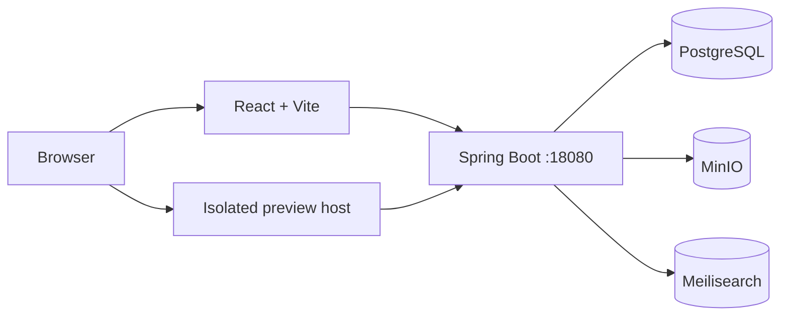

# 知匣（KBPack）

> 面向个人与家庭 NAS 的 HTML 知识包管理平台。上传 AI 生成的 HTML/ZIP 知识资料，在保留原始页面体验的同时完成内容抽取、全文检索、分类归档与版本管理。


知匣适合保存教程、报告、产品手册、交互式演示等 HTML 知识资料。系统将原始文件存入 MinIO，将结构化元数据存入 PostgreSQL，并把抽取后的章节和文本写入 Meilisearch，最终提供原样预览与阅读模式两种使用方式。

## 功能

- 上传 ZIP 知识包，自动识别或指定 HTML 入口文件。
- 隔离预览用户上传的 HTML，并支持 CSS、JavaScript、图片等相对资源。
- 异步抽取标题、章节、正文与文件树，失败任务可重试。
- 使用 Meilisearch 进行全文搜索、结果高亮和条件筛选。
- 通过标签、集合、收藏、归档和来源信息整理知识包。
- 管理同一知识包的多个版本，并支持切换当前版本与重新解析。
- 提供响应式管理界面、阅读模式、系统状态和操作记录。
- 内置上传限额、压缩包安全检查、Session 鉴权与一次性预览票据。

## 架构



默认生产拓扑让主站与预览站使用不同源的 Host。主站登录 Cookie 不会发送到预览 Host；预览请求使用短期一次性票据换取路径受限的预览 Cookie。资源受限的个人 NAS 也可以使用单域名兼容模式，让 `/p/*` 与主站复用一条公网穿透，但隔离强度会降低。

## 技术栈

| 层级 | 技术 |
|---|---|
| Web | React 18、TypeScript、Vite、Ant Design、TanStack Query |
| API | Java 21、Spring Boot 3.3、Spring Security、Spring Data JPA |
| 数据 | PostgreSQL 16、Flyway、Spring Session JDBC |
| 文件 | MinIO |
| 搜索 | Meilisearch 1.10 |
| 部署 | Docker Compose、Caddy、Nginx |

## 快速开始

### 环境要求

- Java 21、Maven 3.9+
- Node.js 20+、pnpm 9+
- Docker Desktop 或兼容的 Docker Compose 环境

### 1. 启动开发依赖

```bash
docker compose -f docker-compose.dev.yml up -d
```

该命令会在本机启动 PostgreSQL、MinIO 和 Meilisearch。首次启动需要等待三个容器变为 healthy。

### 2. 启动后端

```bash
cd kbpack-app
mvn spring-boot:run -Dspring-boot.run.profiles=dev
```

后端监听 `18080`。首次连接空数据库时会自动执行 Flyway、创建 MinIO bucket、初始化搜索索引，并创建开发管理员。

### 3. 启动前端

另开终端：

```bash
cd kbpack-web
corepack pnpm install
corepack pnpm dev
```

打开 [http://kb.localtest.me:5173](http://kb.localtest.me:5173)，使用以下仅限本机开发的账号登录：

```text
用户名：admin
密码：admin123456
```

预览站使用 `http://kb-preview.localtest.me:18080`。如果 `localtest.me` 在当前网络无法解析，可在 hosts 文件中加入：

```text
127.0.0.1 kb.localtest.me kb-preview.localtest.me
```

### 4. 检查服务

```bash
curl -fsS http://localhost:18080/health
curl -fsS http://localhost:18080/health/db
curl -fsS http://localhost:18080/health/storage
curl -fsS http://localhost:18080/health/search
```

四个接口都应返回 `{"status":"up"}`。

## 配置

所有敏感配置都应通过环境变量传入，不要提交真实 `.env` 文件。

| 环境变量 | 开发默认值 | 说明 |
|---|---|---|
| `SERVER_PORT` | `18080` | 后端端口 |
| `SPRING_DATASOURCE_URL` | `jdbc:postgresql://localhost:5432/kbpack` | PostgreSQL JDBC 地址 |
| `MINIO_ENDPOINT` | `http://localhost:9000` | MinIO API 地址 |
| `MEILI_HOST` | `http://localhost:7700` | Meilisearch 地址 |
| `APP_BASE_URL` | `http://kb.localtest.me:5173` | 主站访问地址 |
| `PREVIEW_BASE_URL` | `http://kb-preview.localtest.me:18080` | 隔离预览地址 |
| `PREVIEW_HOST` | `kb-preview.localtest.me` | 允许提供预览资源的 Host |
| `PREVIEW_ENFORCE_HOST` | `true` | 是否严格校验预览请求 Host；仅单域名兼容模式设为 `false` |
| `CORS_ALLOWED_ORIGINS` | `http://kb.localtest.me:5173` | 允许携带凭据访问 API 的精确来源，多个来源用逗号分隔 |
| `COOKIE_SECURE` | `true` | 生产环境登录 Cookie 仅通过 HTTPS 发送 |
| `PREVIEW_TICKET_SECRET` | 仅开发默认值 | 生产环境必须使用强随机值 |
| `INIT_ADMIN_PASSWORD` | `admin123456` | 仅首次初始化用户表时生效 |

端口 `18080` 是项目约定，不使用 `8080`。生产部署前必须更换数据库、MinIO、Meilisearch、预览票据和管理员密码。

## 测试与构建

后端：

```bash
cd kbpack-app
mvn test
```

前端：

```bash
cd kbpack-web
corepack pnpm install
corepack pnpm lint
corepack pnpm build
```

## Docker 部署

复制生产环境模板并替换其中所有 `CHANGE_ME`：

```bash
cp .env.example .env
openssl rand -base64 48
```

### 双域名模式（推荐）

配置主站与预览站域名、DNS 和 HTTPS 后启动：

```bash
docker compose config
docker compose up -d --build
docker compose ps
```

生产拓扑包含 Caddy、前端、后端、PostgreSQL、MinIO 和 Meilisearch。默认 `Caddyfile` 仅在主站暴露 API，并将用户 HTML 限制在独立预览 Host 下。

### 单条公网穿透兼容模式

当公网服务只能提供一条 HTTPS 穿透时，可以让主站和预览共同使用 `https://kb.example.com`，并将该入口转发到 NAS 的单个 HTTP 端口。`Caddyfile.single-origin` 会在同一监听端口上把 `/p/*` 转发到后端、把 `/api/*` 和 `/health*` 转发到后端，其余请求转发到前端。

```dotenv
CADDYFILE_PATH=./Caddyfile.single-origin
HTTP_PORT=28080
APP_HOST=kb.example.com
PREVIEW_HOST=kb.example.com
APP_BASE_URL=https://kb.example.com
PREVIEW_BASE_URL=https://kb.example.com
PREVIEW_ENFORCE_HOST=false
CORS_ALLOWED_ORIGINS=https://kb.example.com
COOKIE_SECURE=true
```

公网穿透只需配置一条映射：`https://kb.example.com` -> `http://<nas-ip>:28080`，无需再为预览开放第二条公网映射。该示例假定 HTTPS 在穿透服务终止；穿透应保留浏览器的 Host 和 Origin，若服务会改写它们，只能对可信转发节点增加精确的恢复规则。修改配置并重新部署后，预览票据接口返回的地址应以 `https://kb.example.com/p/` 开头；旧页面可能保留旧票据，需要强制刷新或重新打开详情页。

此模式让用户上传的 HTML 与管理界面同源，只适合个人使用且内容来源可信的部署。需要接收不可信 HTML 时，应使用默认的独立预览域名模式。

## 项目结构

```text
.
|-- kbpack-app/            # Spring Boot API、解析任务与数据访问
|-- kbpack-web/            # React 管理界面
|-- examples/              # 可用于冒烟测试的知识包样例
|-- scripts/               # 健康检查、备份与恢复脚本
|-- docker-compose.dev.yml # 本地开发依赖
|-- docker-compose.yml     # 完整生产部署
|-- Caddyfile              # 双域名主站与预览站路由
`-- Caddyfile.single-origin # 单域名单穿透兼容路由
```

## 安全说明

- 不要把 `.env`、真实密码、NAS 地址或备份文件提交到 Git。
- 生产环境必须启用 HTTPS，并设置 `COOKIE_SECURE=true`。
- 用户上传的 HTML 可能包含不可信脚本；不可信内容必须使用独立预览 Host 和票据校验，单域名兼容模式仅用于可信内容。
- 默认开发账号和固定开发密钥只适用于本机环境。
- 定期备份 PostgreSQL、MinIO 数据和生产环境配置，并验证恢复流程。

## 参与开发

提交代码前请运行后端测试与前端类型检查/生产构建。较大的功能调整建议先在 GitHub Issue 中说明使用场景、行为变化与兼容性影响。

## 许可证

本项目基于 [MIT License](./LICENSE) 发布。
